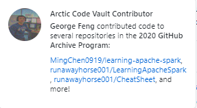

### Hi there 👋 I am Wenqiang Feng:

Generated by [vn7n24fzkq/github-profile-summary-cards](https://github.com/vn7n24fzkq/github-profile-summary-cards)
<!--
**runawayhorse001/runawayhorse001** is a ✨ _special_ ✨ repository because its `README.md` (this file) appears on your GitHub profile.
<!-- 

-->

<!--
-->

<!--

--> 

- 🔭 I’m currently working on ML and Deeplearning
- 🌱 I’m currently learning NLP
- 👯 I’m looking to collaborate on PySpark packages
- 🤔 I’m looking for help with Engligh 
- 💬 Ask me about anything, I am more than happy to help!
- 📫 How to reach me: von198@gmail.com
- 😄 Pronouns: Wen - Pronounce as **"wen"** in "when"
                Qiang - Pronounce as **"chi-"** in "chin" + **"ang-"** in "angry"
- ⚡ Fun fact: ...

